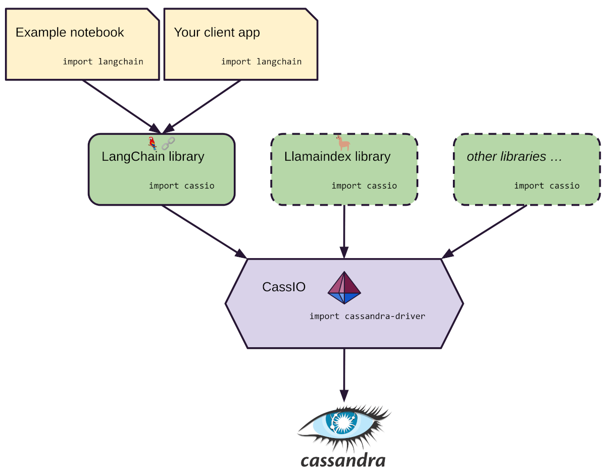

<!--  -->
<!--  -->

CassIO is the ultimate solution for seamlessly integrating [Apache Cassandra®](https://cassandra.apache.org) with generative artificial intelligence and other machine learning workloads. This powerful Python library simplifies the complicated process of accessing the advanced features of the Cassandra database, including vector search capabilities. With CassIO, developers can fully concentrate on designing and perfecting their AI systems without any concerns regarding the complexities of integration with Cassandra.

Keep reading and explore the site for more info, or pick and run a [code example](/start_here/) straight away.

## Features at a glance

CassIO gives you the power to access the latest Cassandra capabilities
for your ML needs, without having to become a Cassandra expert.
This includes efficient usage of
data structures for key-value storage, text caching, chat history
management and -- crucially -- Vector Similarity Search.

!!! info "What is Vector Similarity Search?"

        Vector Similarity Search is a powerful information retrieval technique,
        used to find similar items based on their vector representations.

        Embedding vectors, which are essentially numerical representations of input data
        (such as text or images), make it possible to identify "similar items"
        (e.g. for text data this means a semantic similarity, regardless of
        the exact words used in the texts you compare).

        Vector Similarity Search can thus be at the heart of applications such as
        recommendation systems, content summarization, image retrieval and much more.
        It provides a scalable and efficient way to search and retrieve relevant
        information even from very large datasets, and can be used across very different
        domains to solve a variety of use cases.

## General architecture

CassIO is the core logic powering various LLM frameworks, utilizing "thin adapters" tailored to fit the particular interfaces of each framework.
As a mediator between your application, a framework like LangChain or LlamaIndex, and the Cassandra database, CassIO is the optimal solution for efficient and effective data management.

## Latest status

CassIO is evolving rapidly. Note that at the time of writing

1. there's support for LangChain and LlamaIndex, with new features still being actively added;
2. some of the LangChain components are still in preview, which is why the setup instructs, for the time being, to install a forked version of the framework (namely, Prompt Templates and metadata support in vector stores are not yet into upstream);
3. CassIO can be used also directly in your application (for instance, for a non-language-based Vector Search need): this is also covered in the present documentation.

## Trademark

Apache®, Apache Cassandra®, and the eye logo are either registered trademarks or trademarks of the Apache Software Foundation in the United States and/or other countries.
