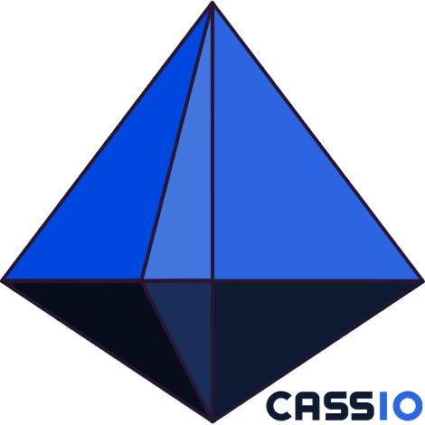

## Welcome to CassIO

Do you want to use [Apache Cassandra®](https://cassandra.apache.org) with your ML/LLM/GenAI workloads,
and **do you want to start NOW**?

This is the place for you.

## Installation and usage

Installing CassIO is as simple as

```
pip install cassio
```

However, most likely you will want to use third-party frameworks,
such as LangChain, that in turn _use_ CassIO.
Depending on how these frameworks are structured,
they may require CassIO upfront in their sub-dependencies
or you might have to manually install it.

!!! example

    A good example is the LangChain setup outlined [here](/frameworks/langchain/setup/):
    the LangChain framework itself does not list all of the packages
    it _might_ need and it is up to the user to pick, and install,
    those that will actually be needed by their application.
    In fact, you can see `cassio` being explicitly listed in the
    [requirements file](https://github.com/CassioML/cassio-website/blob/main/docs/frameworks/langchain/requirements_langchain.txt) for these demo notebooks.

## How to use this site

Don't just browse the website: you should clone the [repository](https://github.com/cassioML/cassio-website)
and start running the code examples yourself (notebooks, tutorials, full-fledged small applications).
You'll find everything in this repo.

### General pre-requisites

Most code examples require a Cassandra / Astra DB database.
In the [general setup instructions](/db_setup), we show how to create a free Astra DB instance out of convenience,
but of course you can use any Cassandra installation, provided you adapt
the few lines of code that connect to your database.

!!! info "Experimental Cassandra features"

    Some of the features rely on the "Vector Search"
    capabilities, which are being added to Cassandra right now.

    If you want to experiment with these, you have several options:
    you can build and run locally a version of Cassandra that implements
    these features from a pre-release branch, or you can create
    an Astra DB instance choosing to enable the vector capabilities,
    now in Public Preview.

    Keep reading to find out more.

Similarly, many of the examples need access to a third-party
service for LLMs and embeddings (for instance, Google's Vertex AI or OpenAI):
make sure you follow the [API setup](/api_setup) to configure the
necessary API Keys and other secrets for your provider of choice.

### Per-framework specific setup

We cover Cassandra integrations with several ML-centric tools and frameworks:
for each of them (a section of the site), there is a subdirectory with
explanations and examples. The code there is stand-alone, provided you
did the general setup (see above): but usually you have first to
go through a framework-specific setup (covering e.g. the setup
of a suitable Python environment with the right dependencies),
described at the top of the section.

!!! example

    If you want to run the sample code for [LangChain](/frameworks/langchain/about/) follow these steps:

    1. clone [this repo](https://github.com/cassioML/cassio-website);
    2. do the [general DB setup](/db_setup);
    3. do the [local DB setup](/local_db_setup) if needed;
    4. do the [API setup](/api_setup);
    5. do the [LangChain-specific setup](/frameworks/langchain/setup/).

    At this point you can fire up Jupyter notebook and start running any of the
    provided notebooks.
    When moving on to testing another framework, only the last step will be needed.

## CassIO repository

The source code is available at [this location](https://github.com/CassioML/cassio).
