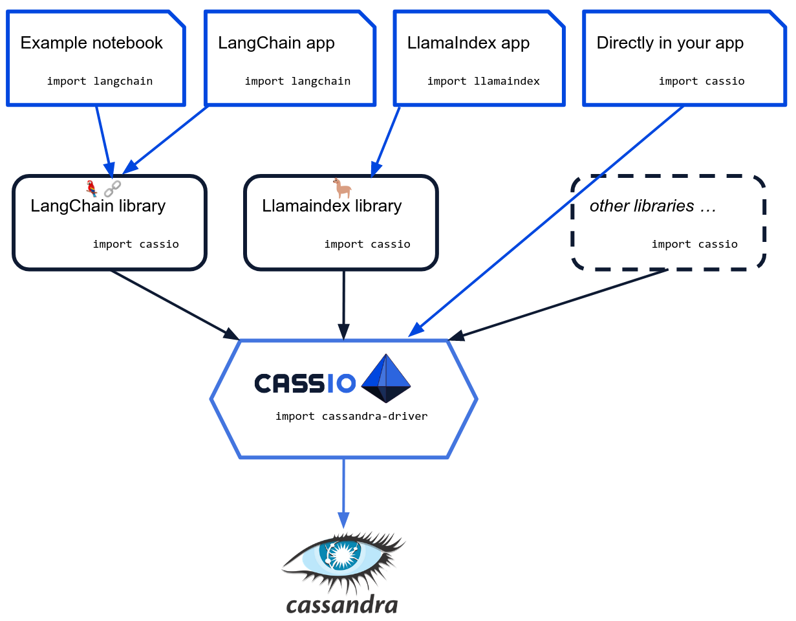

<!--  -->
<!--  -->

CassIO is a python library developed for integrating Apache Cassandra® with generative artificial intelligence (AI) and other machine learning workloads.

CassIO abstracts the process of accessing Cassandra, including Vector Search capabilities, offering a set of ready-to-use tools that minimize the need for additional code.

CassIO is framework agnostic, streamlining integration irrespective of the AI toolkit used, and also integrates seamlessly with LangChain. It provides various features, including memory modules for storing conversational data, caching responses, automatic data injection, and support for "partialing" of prompts.

CassIO leverages Vector Search capabilities in Cassandra and DataStax Astra DB to enable "semantically aware" tooling and scalable, low-latency access to data, including a cache of language model responses, a "semantic index" for knowledge storage and retrieval, and a "semantic memory" for chat interactions

Keep reading and explore the site for more info, or pick and run a [code example](/start_here/) straight away.

## Features at a glance

CassIO gives you the power to access the latest Cassandra capabilities
for your ML needs, without having to become a Cassandra expert.
This includes efficient usage of
data structures for key-value storage, text caching, chat history
management and -- crucially -- Vector Similarity Search.

!!! info "What is Vector Similarity Search?"

        Vector similarity search is a powerful information retrieval technique,
        used to find similar items based on their vector representations.

        Embedding vectors, which are essentially numerical representations of input data
        (such as text or images), make it possible to identify "similar items"
        (e.g. for text data this means a semantic similarity, regardless of
        the exact words used in the texts you compare).

        Vector similarity search can thus be at the heart of applications such as
        recommendation systems, content summarization, image retrieval and many more.
        It provides a scalable and efficient way to search and retrieve relevant
        information even from very large datasets, and can be used across very different
        domains to solve a variety of use cases.

## General architecture

CassIO is the core logic powering various LLM frameworks, utilizing "thin adapters" tailored to fit the particular interfaces of each framework.
As a mediator between your application, a framework like LangChain or Llamaindex, and the Cassandra database, CassIO is the optimal solution for efficient and effective data management.

#### Latest status

CassIO is evolving rapidly. Note that at the time of writing

1. only LangChain is supported;
2. a fork of LangChain is needed (a PR to upstream is on its way).

## Trademark

Apache®, Apache Cassandra®, and the eye logo are either registered trademarks or trademarks of the Apache Software Foundation in the United States and/or other countries.
