CassIO is designed to power several LLM frameworks. In the following quickstart,
you will see it in action within one such framework,
[LangChain](https://docs.langchain.com/docs/).
You will run a short question-answering (QA) example, whereby an input corpus of text
is first inserted into a Vector Search database index and then, for a given
"user question", queried to retrieve the relevant subdocuments and construct an
answer to the question.

The quickstart is designed to run out-of-the-box as a notebook in
Google Colaboratory ("Colab" for short)
and to use Astra DB as the Vector Database -- this choice works fully in the cloud,
with nothing to install on your machine.

??? tip "Other ways to run the examples"

    This quickstart assumes you'll use an Astra DB cloud database from Google Colab.

    If you prefer, however, you can run the very same examples using Jupyter on your
    machine instead of Colab: only the setup is a bit different. Check the
    ["Further Reading"](/more_info/) section for details.

    The "nothing to install" approach would be to use a cloud database
    on DataStax Astra DB.
    Should you prefer to run a local Cassandra cluster, consult the
    ["Further Reading"](/more_info/) section for setup instructions.

We'll come to the code in a moment;
first, let's check the pre-requisites needed to run the examples.

## Database

### Cassandra

Please follow the [specific instructions](/more_info/#use-a-local-vector-capable-cassandra)
on how to get Cassandra 5 running if this is your preferred route.

### Astra DB

Alternatively, you can use an Astra DB cloud instance,
ready in minutes without leaving the browser.

??? info "What is Astra DB?"

    Astra DB is a serverless DBaaS by DataStax, built on Apache Cassandra. It offers
    a free tier with generous traffic and storage limits. Using Astra DB frees you
    from the hassle of running your own cluster while retaining all the advantages,
    such as the excellent data distribution and very high availability that
    make Cassandra a world-class NoSQL database.

Go to [astra.datastax.com](https://astra.datastax.com) register,
and look for "Create Database".
Ensure you pick the "vector" option when creating the DB.

Depending on your Astra preferences, you _may_ be asked to provide a name
for a "Keyspace" in the database (essentially a way to group tables).
Correspondingly, here, when asked please provide the
keyspace name (we'll assume you used `cassio_tutorials`), or leave it empty.

In a couple of minutes your database will be in the "Active" state, as
shown in the DB Quickstart page ([more info](https://awesome-astra.github.io/docs/pages/astra/create-instance/)).

Now you need two connection parameters:

- the **Database ID**, such as `01234567-89ab-cdef-0123-456789abcdef`;
- the (Database Administrator) **Token**, such as `AstraCS:aZ90...`.

These can be located/generated on the Astra dashboard
(more info
[here](https://awesome-astra.github.io/docs/pages/astra/faq/#where-should-i-find-a-database-identifier)
and
[here](https://awesome-astra.github.io/docs/pages/astra/create-token/)
respectively).

!!! warning "Locate the Database ID"

    Some choices of the appearance of the Astra dashboard expose the
    "API Endpoint" connection parameter instead of the ID itself.

    You can read the database ID from the endpoint by looking at the first
    part of the domain name, the one before the region name: for instance if
    your API endpoint is "https://01234567-89ab-cdef-0123-456789abcdef-us-east1.apps.astra.datastax.com",
    the database ID to use here will be `01234567-89ab-cdef-0123-456789abcdef`.

## LLM Access

In order to run the quickstart, you should have access to an LLM.
You will be asked to provide the appropriate access secrets in order to run
the full code example: make sure you have them ready.

The notebooks currently support the following providers for LLMs:

- [OpenAI](https://openai.com/). In this case you will be asked for a valid API Key.
- [GCP Vertex AI](https://cloud.google.com/vertex-ai). In this case you need a JSON API for a Service Account whose permissions include the Vertex AI API.
- [Azure OpenAI](https://learn.microsoft.com/en-us/azure/cognitive-services/openai/). In this case you will need several parameters: the base URL to your Azure OpenAI resource, the API version string, an API Key, and the deployment and model name for both the LLM and the embedding models.

See the inserts below for more information on each provider.

??? info "OpenAI"

    Log in with [OpenAI](https://openai.com/) (creating an account if you haven't yet).

    By visiting the [API Keys](https://platform.openai.com/account/api-keys) page
    in your user account, you will be able to generate an API Key. Make sure to
    copy it and store it in a safe place.

    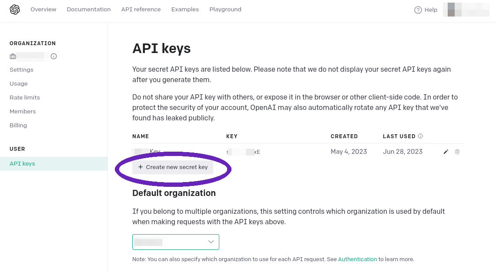

??? info "GCP Vertex AI"

    In order to use Google's Vertex AI service, you need an [account](https://cloud.google.com/vertex-ai)
    with access to that service. 

    Once you log in, go to the [API Credentials Console](https://console.cloud.google.com/apis/credentials), make sure the right project is selected, and click "Create Credentials".

    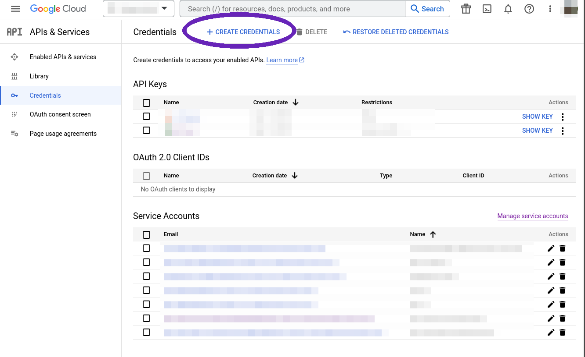

    Choose to generate a "Service account" and fill the wizard, then hit "Done".

    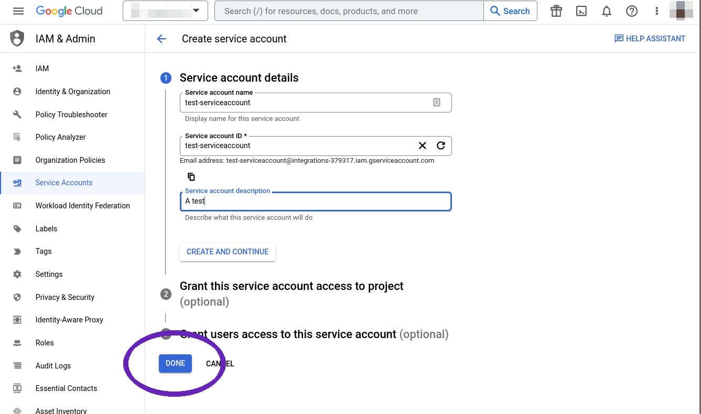

    The new service account will be visible in the "Credentials" list. Click the "edit" symbol
    next to it, then go to the "Keys" tab for this account.

    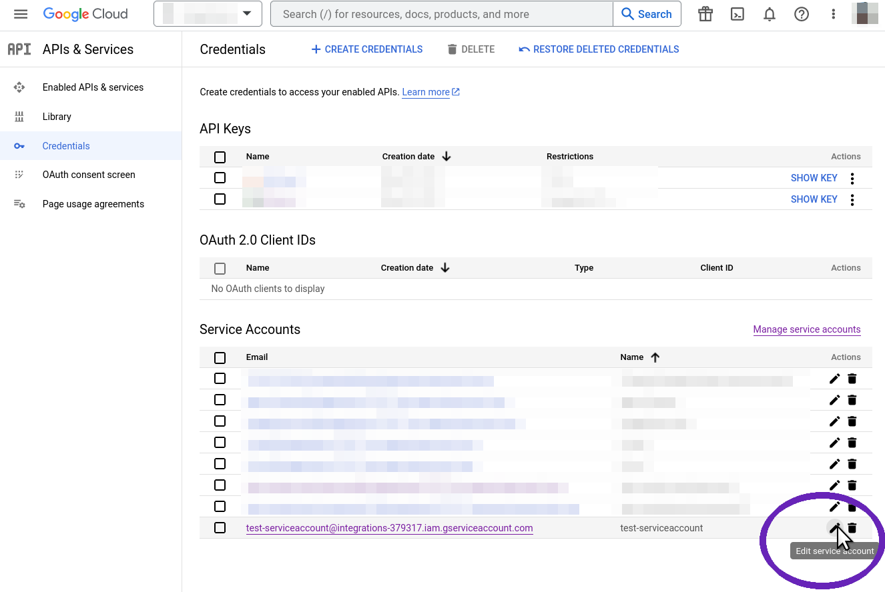

    There will be no keys yet:
    click "Add Key" to create a new one and make it of "JSON" type. You will be prompted to
    save the JSON key file. **Save it on your computer in a safe place, as it will not be
    made available again.**

    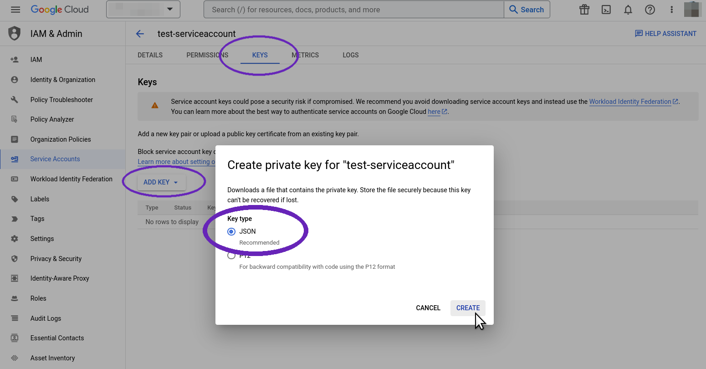

    That's it: the full path to the JSON key is the required secret for Vertex AI.

??? info "Azure OpenAI"

    To use LLMs and embedding services from Azure OpenAI, you first need to create
    a "Resource" in OpenAI Studio and deploy the desired models in it.
    Next, you retrieve the secrets and connection parameters needed for
    programmatic API access.

    First you need an Azure account allowed to access
    the [Azure OpenAI](https://learn.microsoft.com/en-us/azure/cognitive-services/openai/) service.

    Log in to the [Azure Portal](https://portal.azure.com) and choose the "Azure OpenAI" service
    in the dashboard.

    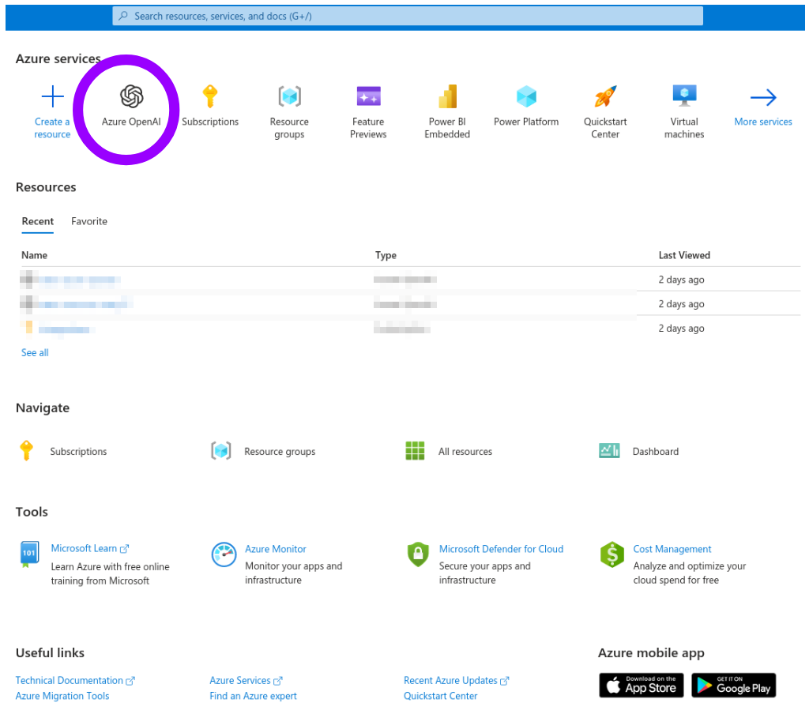

    You will see a list of "Resources" (initially empty). Click "Create" and fill
    the "Create Azure OpenAI" wizard. (You may need to create a "Resource Group"
    if you don't have one already.)

    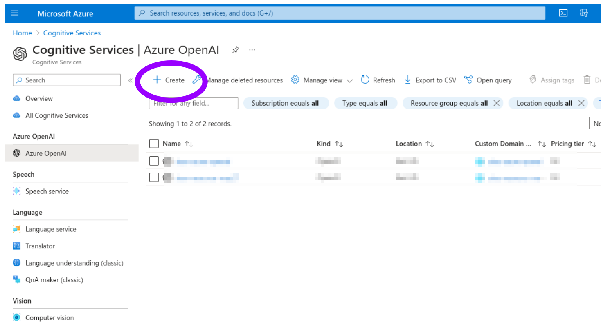

    Confirm the process by clicking "Create" at the end of the wizard.

    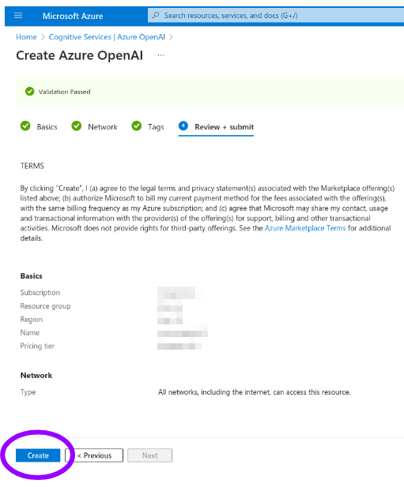

    After a few minutes with "Deployment in progress...", you will see
    "Your deployment is complete". You can click "Go to resource".

    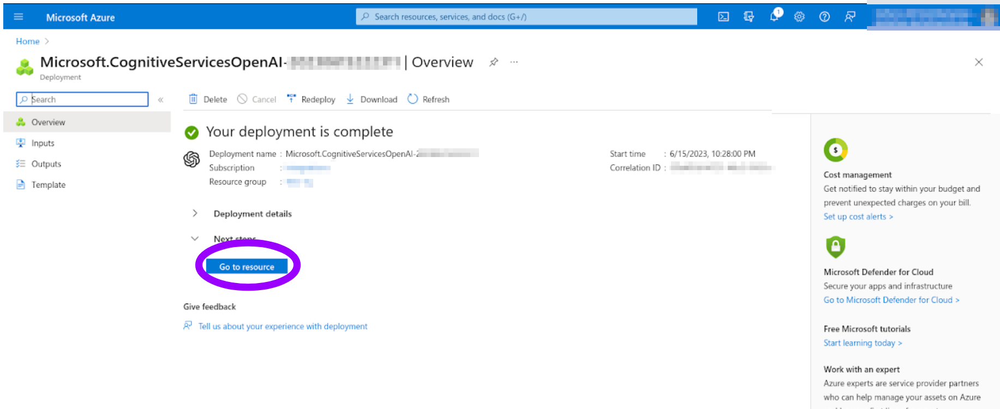

    Now, you can "Deploy" a model in your newly-created resource.

    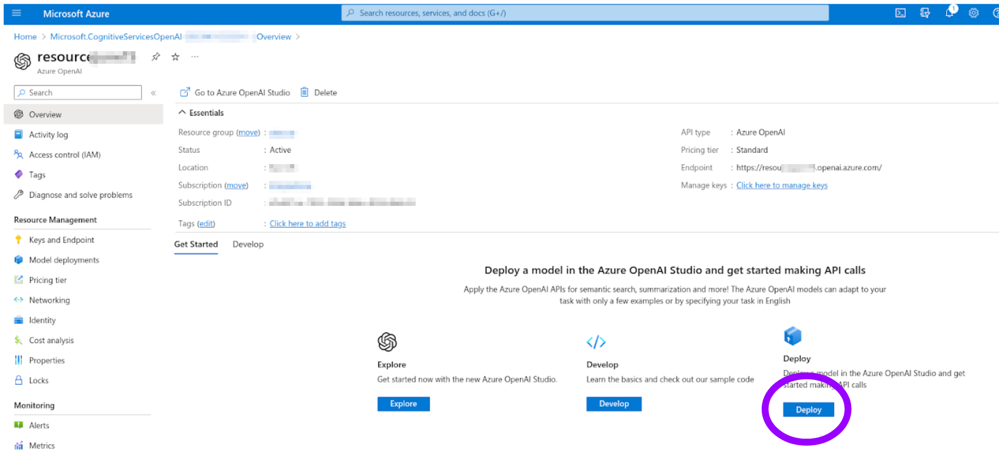

    The current deployment list is empty: click "Create new deployment" and pick
    the model you want. Notice that to have _both an LLM and an embedding model_
    you have to do _two separate deployments_. **Take note of the exact
    deployment name (which you freely choose) and of the model name
    (chosen from a list)**, as these will be needed among the connection parameters.

    Your models should now be available. To retrieve the connection parameters,
    start from the [Azure OpenAI Studio](https://oai.azure.com/portal) and click
    on the "Playground/Chat" item in the left navigation bar.

    Locate the "View code" button at the top of the "Chat session" panel and
    click on it.

    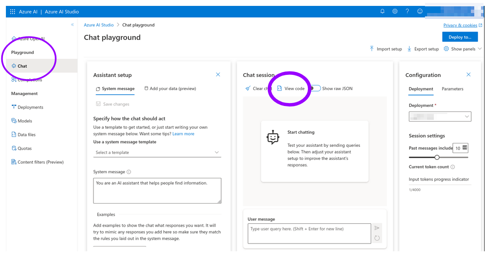

    A dialog will be shown (make sure that Python code is
    the selected option), where you will find the remaining
    connection parameters: the API Version, the "API Base"
    (an URL to your resource), and the API Key (shown as masked copyable text box).

    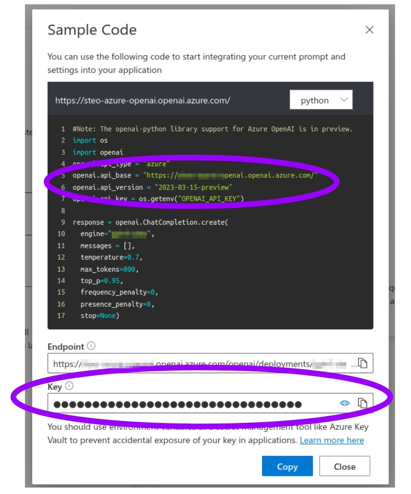

    This is it: keep the connection parameters you just collected, as you will
    have to supply them to run the examples.

## Run the quickstart

Once you have the DB ID and Token as outlined above,
plus the LLM secret(s),
click on the Colab Notebook link below
to start using your Vector Search Database in the LangChain QA example:

  

## What now?

Now you have first-hand experience on how easily you can power
up your application with Vector Search capabilities.

Check out other use cases which benefit from Vector Search, and other ways to
enrich your application with LangChain and Cassandra, by browsing the
[LangChain section](/frameworks/langchain/about/) of the site.

Or take a look at the various ways to use CassIO besides LangChain -- check
out the other sections of the site.

**Tip:** Look for the Colab

symbol at the top of most code examples.
